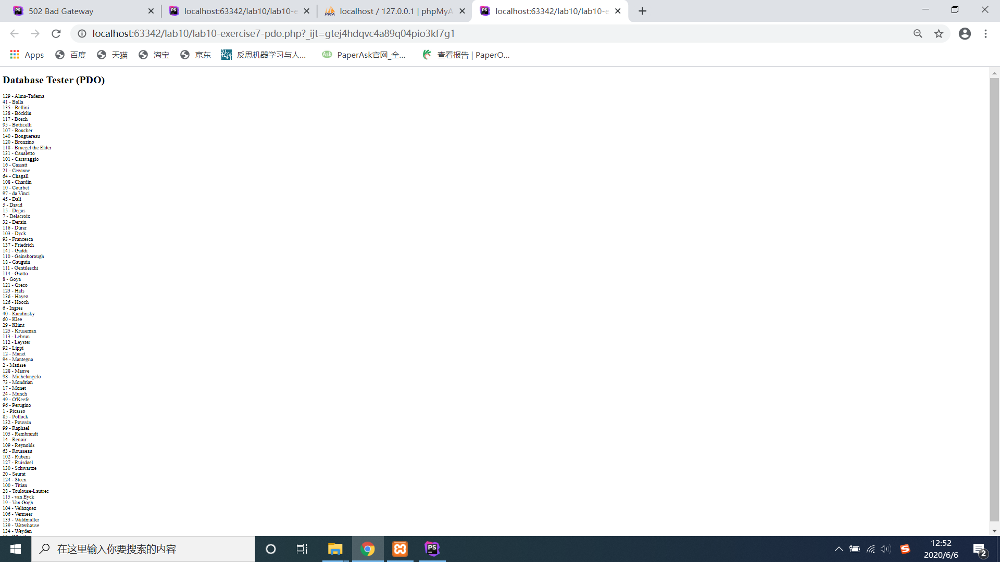
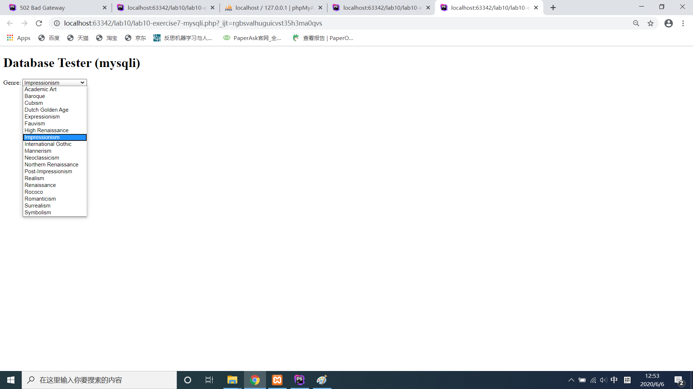
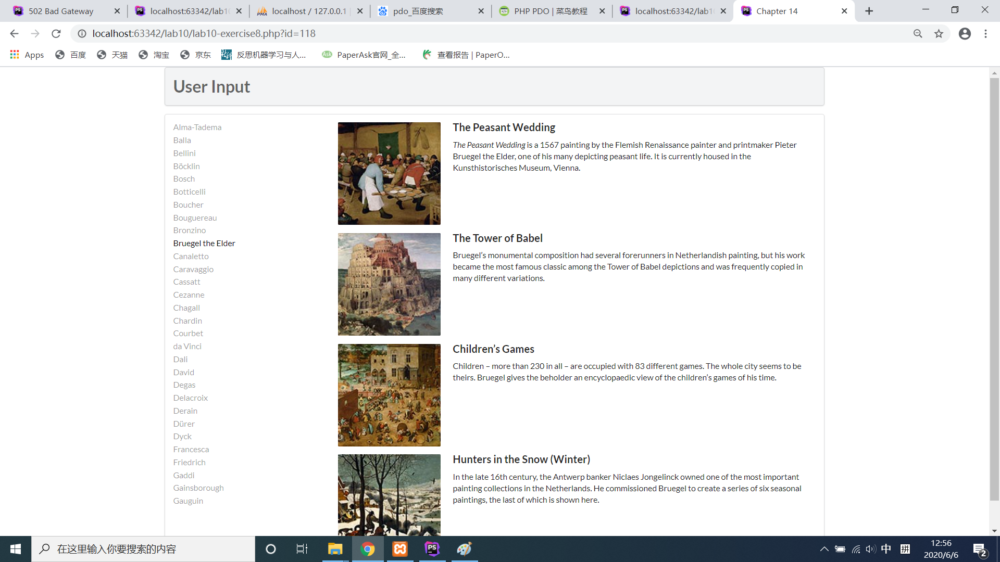
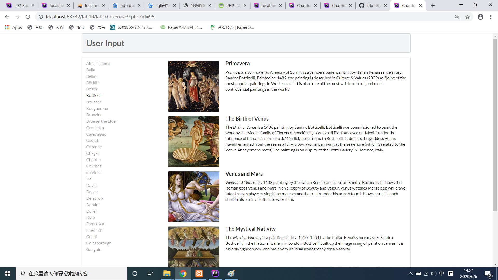

#lab10开发文档
>19302010004黄呈松
###exercise7
####截图
pdo
  
mysql
  
####代码解释
```php
   define('DBHOST', 'localhost'); //服务器localhost 
   define('DBNAME', 'art');  //数据库名art
   define('DBUSER', 'testuser');  //账户名testuser
   define('DBPASS', 'mypassword');  //密码mypassword
   define('DBCONNSTRING','mysql:dbname=art;charset=utf8mb4;');//连接方式与字符集 ?>
```
 ```html
   <?php require_once('config.php'); ?>//引入config.php
   <!DOCTYPE html>
   <html>
   <body>
   <h1>Database Tester (PDO)</h1> <?php
   try {
     $pdo = new PDO(DBCONNSTRING,DBUSER,DBPASS);  //新建pdo对象，即连接数据库
     $pdo->setAttribute(PDO::ATTR_ERRMODE, PDO::ERRMODE_EXCEPTION); //设置属性 
     $sql = "select * from Artists order by LastName";//将要执行的sql指令，搜索从artists表中搜索，通过lastname排序
     $result = $pdo->query($sql);//执行命令
     while ($row = $result->fetch()) {//遍历每个序列
         echo $row['ArtistID'] . " - " . $row['LastName'] . "<br/>"; 
     }
     $pdo = null; //断开连接
   }catch (PDOException $e) { 
       die( $e->getMessage() );//如果出错返回错误代码
   }
   ?>  
   </body>  
   </html>
```
```
<?php require_once('config.php'); ?>//引入config.php(之后相同的不再重复
<!DOCTYPE html>
<html>
<body>
<h1>Database Tester (mysqli)</h1> Genre:
<select>
<?php  
$connection = mysqli_connect(DBHOST, DBUSER, DBPASS, DBNAME); //链接数据库
if ( mysqli_connect_errno() ) {//判断是否连接成功
   die( mysqli_connect_error() ); //报错
}
$sql = "select * from Genres order by GenreName"; 
if ($result = mysqli_query($connection, $sql)) {
  // loop through the data
  while($row = mysqli_fetch_assoc($result)) {//获取对应该条信息
     echo '<option value="' . $row['GenreID'] . '">'; 
     echo $row['GenreName'];
     echo "</option>";//加入一个选项
  }
  // release the memory used by the result set
  mysqli_free_result($result); 
}
// close the database connection
mysqli_close($connection);
?>
</select>
</body>
</html>
```

###exercise8
  
```
function outputArtists() {//输出左端艺术家们
   try {
         $pdo = new PDO(DBCONNSTRING,DBUSER,DBPASS);//新建pdo
         $pdo->setAttribute(PDO::ATTR_ERRMODE, PDO::ERRMODE_EXCEPTION);
         $sql = "select * from Artists order by LastName limit 0,30";//选取前30个
         $result = $pdo->query($sql);/执行命令
         while ($row = $result->fetch()) {
            echo '<a href="' . $_SERVER["SCRIPT_NAME"] . '?id=' . $row['ArtistID'] . '" class="';//链接向本页面以get方式返回一个artistid
            if (isset($_GET['id']) && $_GET['id'] == $row['ArtistID']) echo 'active ';//如果是被返回的id则加上active的class名
            echo 'item">';
            echo $row['LastName'] . '</a>';//内容
         }
         $pdo = null;//删除链接
   }
   catch (PDOException $e) {
      die( $e->getMessage() );
   }
}
```
```
function outputPaintings() {//返回右边所有图片
    try {
        if (isset($_GET['id']) && $_GET['id'] > 0) {//如果有上传至本页面的id
            $pdo = new PDO(DBCONNSTRING,DBUSER,DBPASS);
            $pdo->setAttribute(PDO::ATTR_ERRMODE, PDO::ERRMODE_EXCEPTION);
            $sql = 'select * from Paintings where ArtistId=' . $_GET['id'];//从paintings表中寻找artistid为上传id的
            $result = $pdo->query($sql);//执行指令
            while ($row = $result->fetch()) {
                outputSinglePainting($row);//执行另一个函数返回单个图片信息
            }
            $pdo = null;
        }
    }catch (PDOException $e) {
        die( $e->getMessage() );
    }
}
```
```
function outputSinglePainting($row) {
    echo '<div class="item">';
    echo '<div class="image">';
    echo '';//图片
    echo '</div>';//end class-image
    echo '<div class="content">';//右边内容
    echo '<h4 class="header">';
    echo $row['Title'];
    echo '</h4>';
    echo '<p class="description">';
    echo $row['Excerpt'];
    echo '</p>';
    echo '</div>'; // end class=content
    echo '</div>'; // end class=item
}
```

###exercise9

  
```
function outputPaintings() {
    try {
        if(isset($_GET['id']) && $_GET['id'] > 0) {
            $pdo = new PDO(DBCONNSTRING,DBUSER,DBPASS);
            $pdo->setAttribute(PDO::ATTR_ERRMODE, PDO::ERRMODE_EXCEPTION);

            $sql = 'select * from Paintings where ArtistId=:id';
            $id = $_GET['id'];

            $statement = $pdo->prepare($sql);//预处理sql语句
            $statement->bindValue(':id', $id);//绑定对应id
            $statement->execute();//执行语句

            while ($row = $statement->fetch()) {
                outputSinglePainting($row);
            }
            $pdo = null;
        }
    }catch(PDOException $e) {
        die( $e->getMessage() );
    }
}
```
优点：只需要进行一次查询，减少带宽占用，防止sql注入
###exercise10
无截图
就根据genreid排序后输出图片