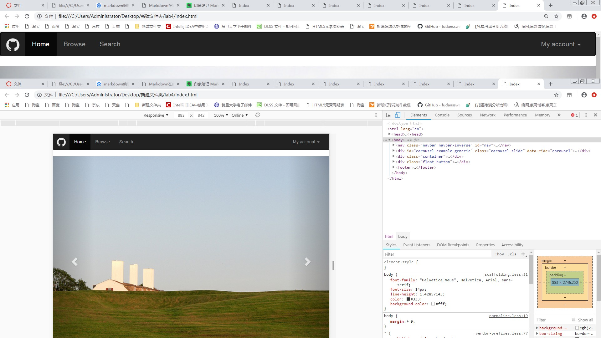
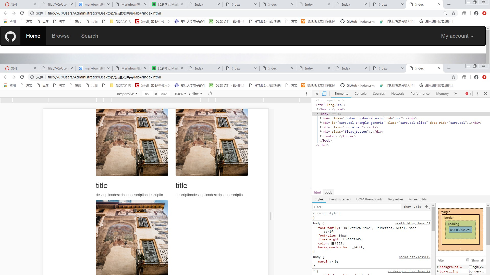
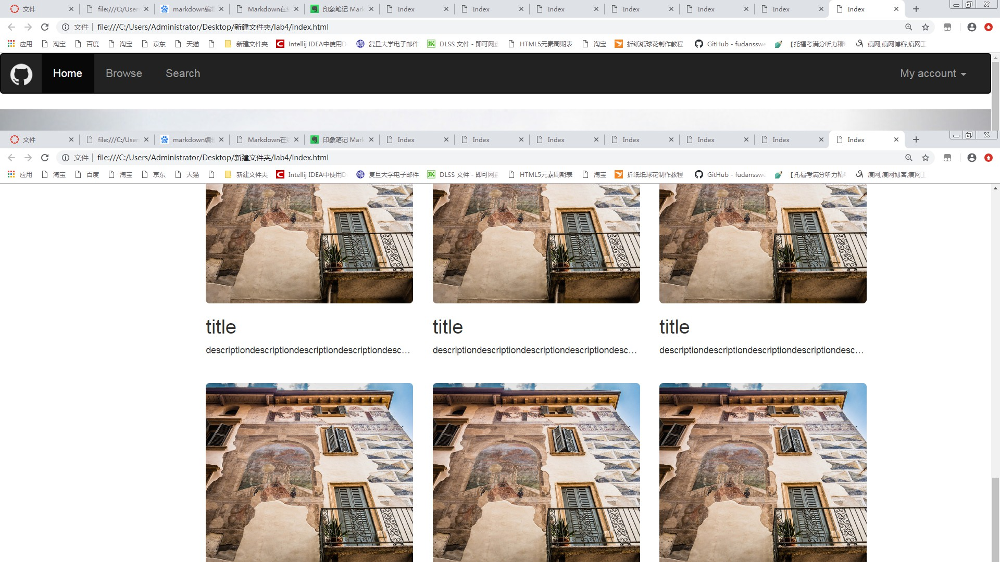

> 黄呈松 19302010004

## 主页截图

### 截图1



### 详细信息

* 导航栏的class为

```css
navbar navbar-inverse navbar-fixed-top
```

 **navbar-inverse** 反色，**navbar-fixed-top**表示导航栏始终置顶


* 图片大小的class为

```css
col-xs-6 col-lg-4
```

其中 **col-xs-6** 表示当屏幕较小时，图片宽度为 **1/2** 


 **col-lg-4 **表示当屏幕较大时，图片宽度为 **1/3**




* footer的class为

```css
panel-footer
```

这样子footer的底色为#F5F5F5

* 图片大小的class为

右下角浮动按钮为图片
```css
position：fixed
```

刷新键更换图片的js
```js
       refresh_button.onclick = function() {
                var img_blocks = document.getElementsByClassName("img-rounded");
                for (var i = 0; i < img_blocks.length; i++) {
                    img_blocks[i].setAttribute("src", "../lab4/images/travel-images/normal/medium/pic (" + Math.floor(2 + Math.random() * 70) + ").jpg")
                }
            }
```

用anchor回到顶端
```html
<a href="#nav">
```

