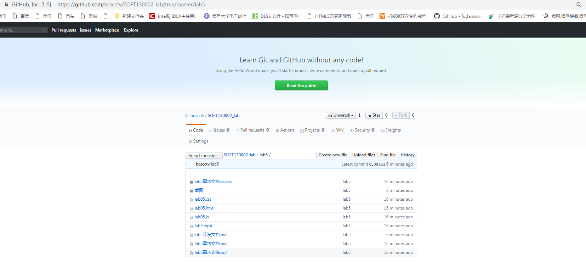
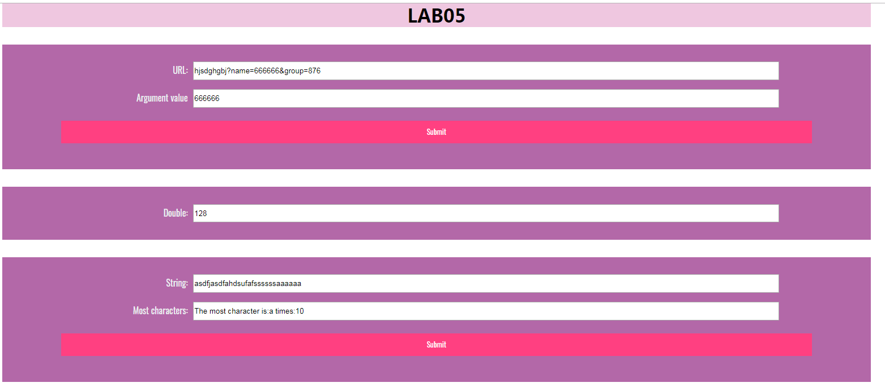

# lab5开发文档

##### 19302010004 黄呈松

## 解决方案

### 第一题解决方案
> 运用正则表达式匹配
```
    url_result.value = "no result";//初始化值
    url_result.value = url.value.match(new RegExp('(?<=[?&]name=).*?((?=&)|$)'))[0];
    //通过正则表达式寻找答案
```

### 第二题解决方案
> setInterval计时器，new Date（）寻找已有时间 flag标记是否继续执行
```
let now = new Date();
let min_start = now.getMinutes();
let min_now = now.getMinutes();
let mul = document.getElementById("mul");
mul.value = 1;
let flag = true;

function timeTest() {
    now = new Date();
    min_now = now.getMinutes();
    if (mul.value == 1024 || min_now != min_start) flag = false;
    if (flag) {
        mul.value *= 2;
    }
}
setInterval(timeTest, 5000);
```

### 第三题解决方案
> 关联数组 类似哈希表的处理
```
let index;
    let max = -1;
    let str = most.value;

    let obj = {};
    let letter;
    for (var i = 0, len = str.length; i < len; i++) {
        letter = str[i];
        if (!obj[letter]) {
            obj[letter] = 1;
        } else {
            obj[letter]++;
        }
    }
    for (key in obj) {
        if (max < obj[key]) {
            max = obj[key];
            index = key;
        }
    }
    result.value = "The most character is:" + index + " times:" + max;
```
## 截图

## github截图

## 网页效果截图
