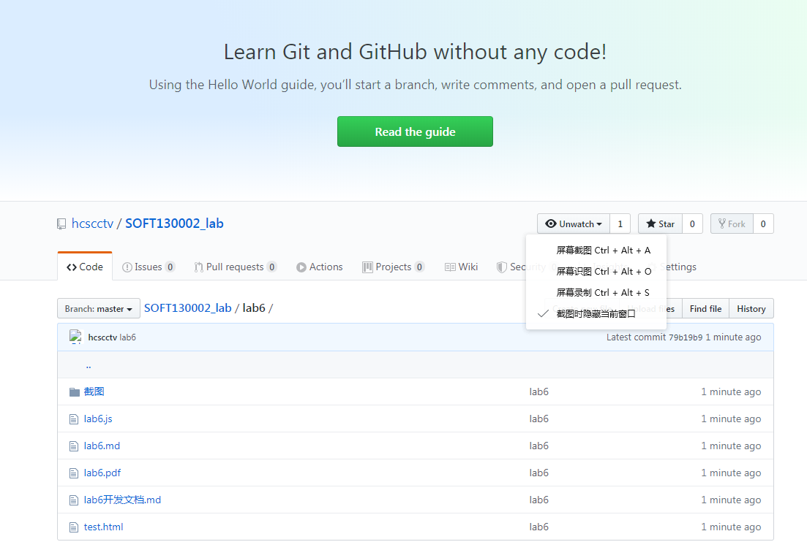
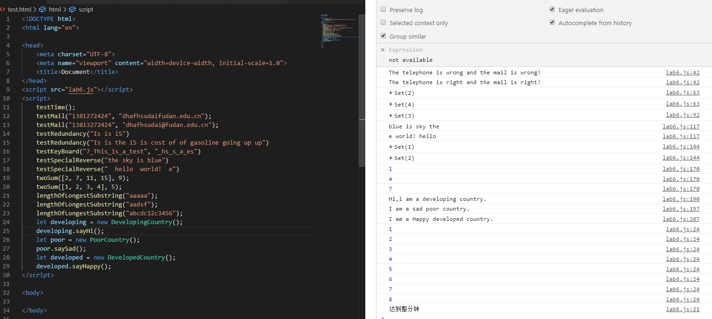

# lab5开发文档

##### 19302010004 黄呈松

## 解决方案

### 第一题解决方案
> 就正常操作
```js
    function testTime() {
    let count = 0;
    let start_min = new Date().getMinutes();
    let interval = setInterval(function() {
        if (count > 10) {
            console.log("达到10次");
            clearInterval(interval);
        } else if (new Date().getMinutes() != start_min) {
            console.log("达到整分钟")
            clearInterval(interval);
        } else
            console.log(++count);
    }, 5000)
}
    //通过正则表达式寻找答案
```

### 第二题解决方案
> 简单正则表达式
```js
function testMail(telephone, mail) {
    let telephone_regexp = new RegExp("^((13[4-9])|(15([0-2]|[7-9]))|(18[237]))[0-9]{8}$");//开头134-139或150 151 152 157-159 182 183 187+任意八位数字
    let mail_regexp = /^([a-zA-Z0-9_-]+)@([a-zA-Z0-9_-]+)((\.[a-zA-Z0-9_-]{2,3}){1,2})$/;//任意位大小写字母或数字_-加上@加上任意位大小写字母或数字_-加上1或两组（.后跟2-3位数字字母
    console.log()
    console.log("The telephone is " + ((telephone_regexp.test(telephone)) ? "right" : "wrong") + " and the mail is " + ((mail_regexp.test(mail)) ? "right!" : "wrong!"));
}
```

### 第三题解决方案
> 简单正则多次匹配加修改匹配起始点加set使用
```js
function testRedundancy(str) {
    let set = new Set();
    let pattern = /\b([a-z]+)\s\1\b/ig;//不急大小写的字母
    let temp;
    while ((temp = pattern.exec(str)) !== null) {
        set.add(temp[0]);
        pattern.lastIndex -= (temp[0].length - 1) / 2;
    }
    console.log(new Set(Array.from(set).sort().slice(0, 10)));//set转array排序后截取前十后转set
}

```

### 第四题解决方案
> 快慢指针（考虑用set否则应该includes更方便）
```js
function testKeyBoard(wantInput, actualInput) {
    wantInput = wantInput.toUpperCase();
    actualInput = actualInput.toUpperCase();
    let point_want = 0;
    let point_actual = 0;
    let ans = new Set();
    while (point_want != wantInput.length) {
        if (wantInput.charAt(point_want) == actualInput.charAt(point_actual)) point_actual++;
        else ans.add(wantInput.charAt(point_want));
        point_want++;
    }
    console.log(ans);
}

```

### 第五题解决方案
> 正则匹配多空格 转为数组翻转
```js
function testSpecialReverse(str) {
    str = str.replace(/\s+/g, " ")
    let strs = Array.from(str.split(" "));
    strs = strs.reverse();
    let ans = "";
    for (let i = 0; i < strs.length; i++) {
        ans += strs[i] + " ";
    }
    ans = ans.trim();
    console.log(ans);
}
```

### 第六题解决方案
> 按照本位数字寻找对应数字是否出现
```js
function twoSum(nums, target) {
    let ans = new Set();
    let map = new Map();
    for (let i = 0; i < nums.length; i++) {
        map.set(nums[i], i);
        if (map.has(target - nums[i])) {
            ans.add([map.get(target - nums[i]), i])
        }
    }
    console.log(ans);
}

```

### 第七题解决方案
> j记录新起点
```js
function lengthOfLongestSubstring(str) {
    let map = new Map();
    let ans = 0;
    let j = 0;
    for (let i = 0; i < str.length; i++) {
        if (map.has(str[i])) {
            j = map.get(str[i]) + 1;
        }
        map.set(str[i], i);
        ans = (ans > i - j + 1) ? ans : i - j + 1;
    }
    console.log(ans);
}

```

### 第八题解决方案
>三种继承方法
```js
function Country() {
    this.name = "国家";
}

function DevelopingCountry() {
    Country.call(this);
}
DevelopingCountry.prototype.sayHi = function() {
    console.log("Hi,i am a developing country.");
}

function PoorCountry() {}

PoorCountry.prototype = new Country();
PoorCountry.prototype.saySad = function() {
    console.log("I am a sad poor country.");
}

function DevelopedCountry() {
    Country.call(this);
}

DevelopedCountry.prototype = Object.create(Country.prototype);
DevelopedCountry.prototype.constructor = DevelopedCountry;
DevelopedCountry.prototype.sayHappy = function() {
    console.log("I am a Happy developed country.");
}

```
## 截图

## github截图

## 网页效果截图
